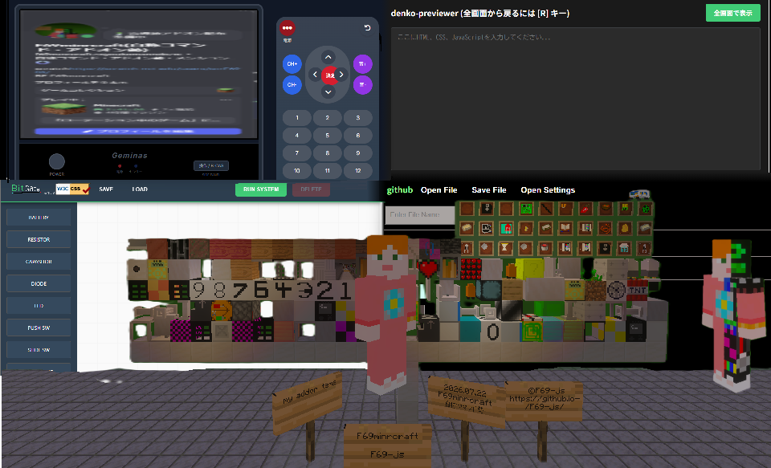
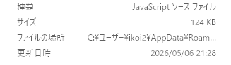

# Hi, There...
---

---
```json
{"info":
    {
        "-4294967295":{
            "name":"F69minrcraft",
            "description":"An ordinary Minecraft add-on creator and web application programmer (as a hobby).",
            "languages":["html","css","javascript","json","md","etc"],
            "warning":"name [6] is not 'e'. name [6] is 'r'".
        }
    }
}
```
ねえ、聞いた？ [今いるrepo](https://github.com/F69-js/F69-js)って特別な場所らしいよ（笑）
---
名前:F69-js(name:F69-js)
別名:`F69js.core.min.js`
言語:
 - html (*Hyper Text Markup Language*)
 * [css (*Cascading Style Sheets*)](https://en.wikipedia.org/wiki/Cascading_Style_Sheets)

- [javascript](https://en.wikipedia.org/wiki/JavaScript)
  - [(js)](https://en.wikipedia.org/wiki/JavaScript)
 * [json(*JavaScript Object Notation)](https://en.wikipedia.org/wiki/JSON)
 - [md(*MarkDown*)](https://en.wikipedia.org/wiki/Markdown)

 - その他...
- 説明: どこにでもいる(?)[Minecraft](https://www.minecraft.net)アドオン開発者
- その他:
実はエラーコレクター
   - [x]F69min**r**craft 
   - [ ]F69min**e**craft
- 主な作品:
 1. [FIDE(F69's IDE)](https://github.com/F69-js/FIDE-F69s-IDE)
 2. [FCCE(F69's Char Code Encoder)](https://github.com/F69-js/FCCEV2-F69s_Char_Code_Encorder)
 - > latest version is [`2.0.15`](https://github.com/F69-js/FCCEV2-F69s_Char_Code_Encorder/releases/tag/FCCE)
 - > npm package is [here](https://www.npmjs.com/package/fcce-v2)
 3. [F69-js:BitGate(CAD)](https://github.com/f69-js/BitGate)
***
- リンク
[minecraft]("https://www.xbox.com/ja-JP/play/user/F69minrcraft")
---
## 追加:「`I wrote main.js over the 100KB for 1 Addon.`(説明欄)`」を表す画像

---
_プロジェクトのバグ報告、機能追加などはgithubの`issues`および`pull request`にお願いします。
**可能なかぎり**修正や機能追加いたします。_
---
**\~以上、[F69-js(F69min~e~**r**craft)の](https://github.com/F69-js) [自己紹介(README)](https://github.com/F69-js/F69-js)でした\~**
